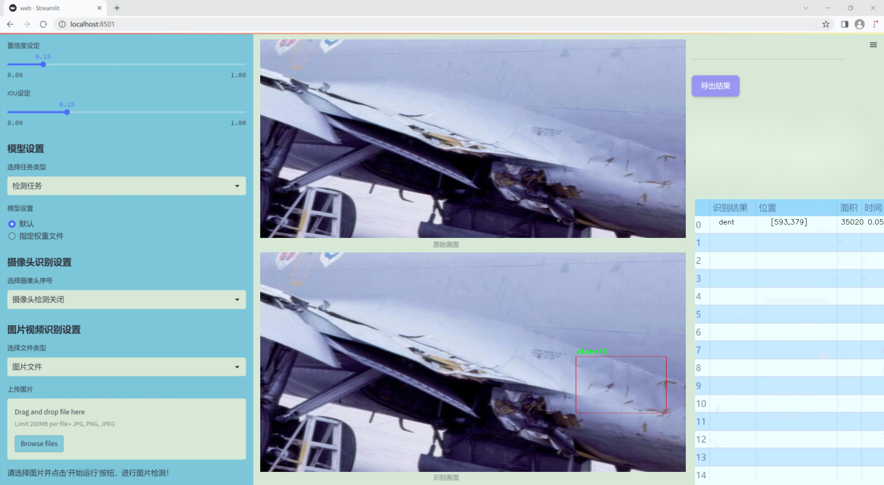
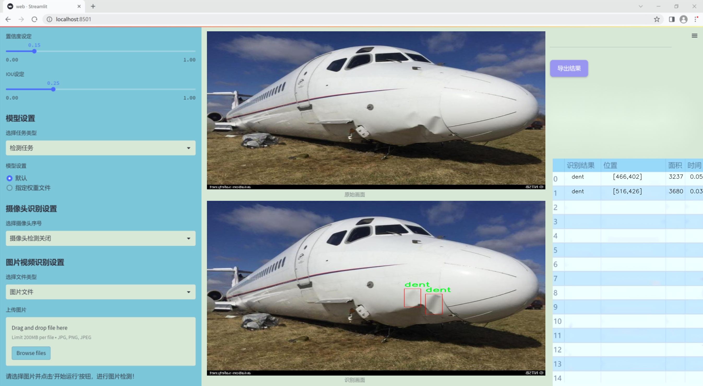
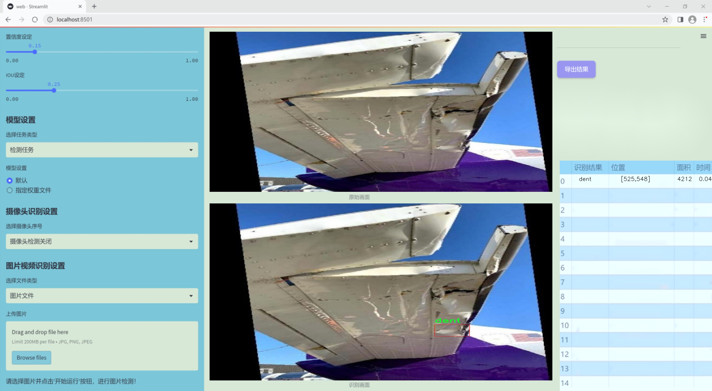
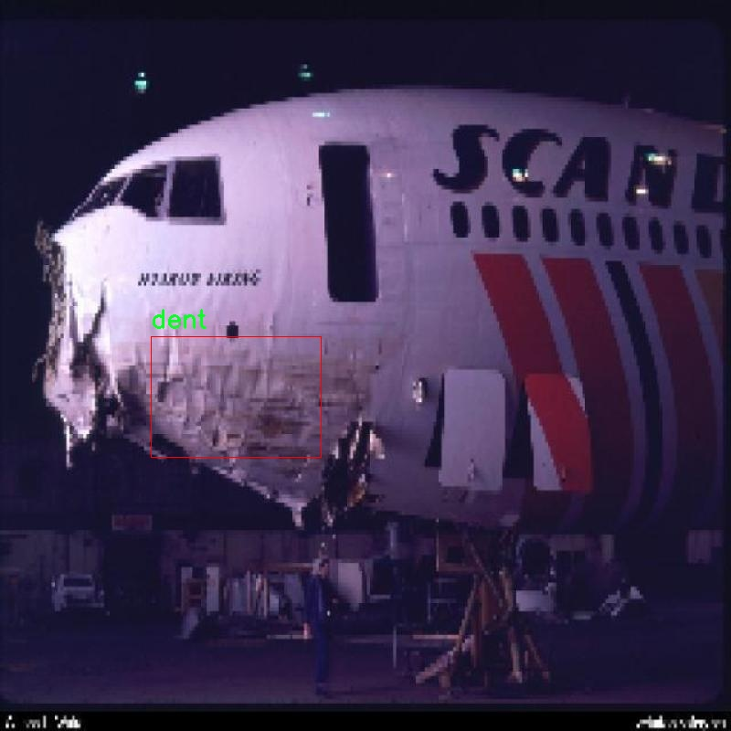
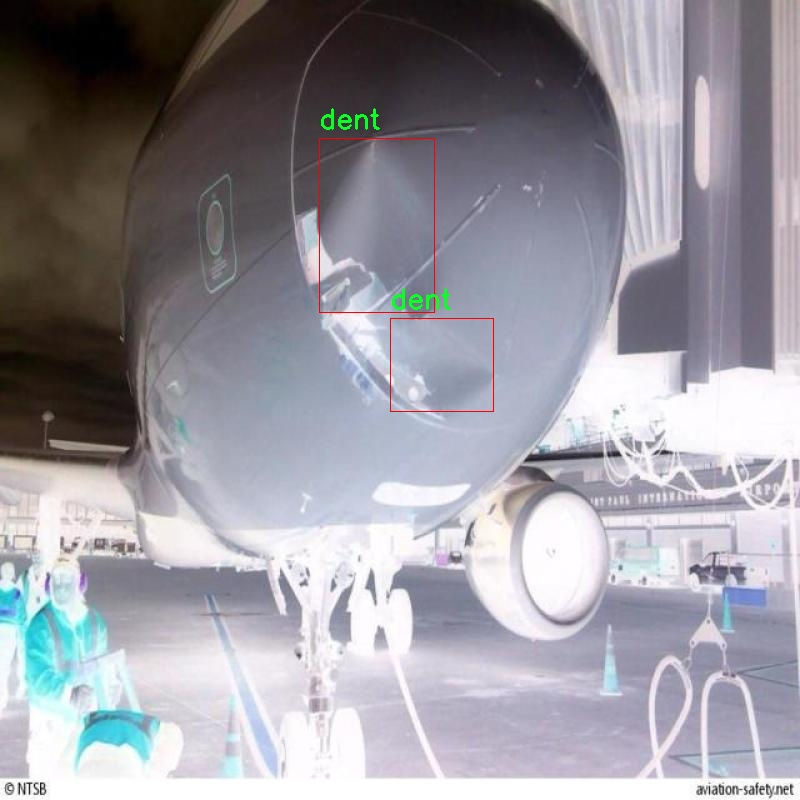
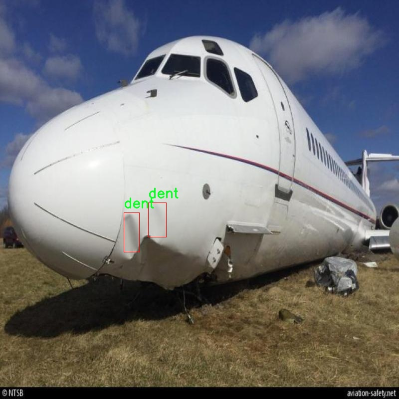
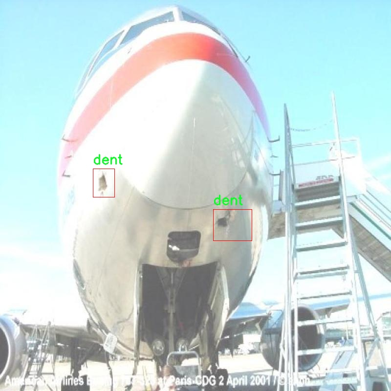

### 1.背景意义

研究背景与意义

随着航空工业的快速发展，飞机的安全性和可靠性成为了行业关注的重点。飞机在使用过程中，表面损伤如凹陷、划痕等问题不仅影响美观，更可能对飞行安全造成潜在威胁。因此，及时、准确地检测飞机表面损伤显得尤为重要。传统的人工检测方法不仅耗时耗力，而且容易受到人为因素的影响，导致漏检或误检的情况发生。为了提高检测效率和准确性，基于计算机视觉的自动化检测系统应运而生。

在众多计算机视觉算法中，YOLO（You Only Look Once）系列算法因其高效的实时检测能力而受到广泛关注。YOLOv11作为该系列的最新版本，具备更强的特征提取能力和更快的推理速度，适合应用于复杂的视觉检测任务。通过对YOLOv11进行改进，结合飞机表面损伤的特点，可以构建一个高效的飞机表面损伤检测系统。该系统不仅能够快速识别和定位损伤，还能为后续的维修和保养提供重要依据。

本研究所使用的数据集包含220张标注图像，主要针对凹陷这一类别进行训练。数据集的设计考虑到了实际应用中的需求，确保了模型在真实场景中的有效性和可靠性。通过对数据集的精细标注和YOLOv11模型的优化，期望能够显著提升飞机表面损伤检测的准确率和效率，为航空安全提供更为坚实的技术支持。

综上所述，基于改进YOLOv11的飞机表面损伤检测系统的研究，不仅具有重要的学术价值，也为航空工业的安全管理提供了切实可行的解决方案。通过这一系统的应用，能够有效降低人工检测的成本，提高飞机维护的及时性，从而保障航空安全，推动航空业的可持续发展。

### 2.视频效果

[2.1 视频效果](https://www.bilibili.com/video/BV127mxYVE3Y/)

### 3.图片效果







##### [项目涉及的源码数据来源链接](https://kdocs.cn/l/cszuIiCKVNis)**

注意：本项目提供训练的数据集和训练教程,由于版本持续更新,暂不提供权重文件（best.pt）,请按照6.训练教程进行训练后实现上图演示的效果。

### 4.数据集信息

##### 4.1 本项目数据集类别数＆类别名

nc: 1
names: ['dent']


该项目为【目标检测】数据集，请在【训练教程和Web端加载模型教程（第三步）】这一步的时候按照【目标检测】部分的教程来训练

##### 4.2 本项目数据集信息介绍

本项目数据集信息介绍

本项目旨在开发一种改进的YOLOv11模型，以实现对飞机表面损伤的高效检测。为此，我们使用了名为“Aircraft Damage Detection 2”的数据集，该数据集专门针对飞机表面损伤的识别与分类而设计。数据集中包含了多种飞机表面损伤的图像，经过精心标注，以确保模型在训练过程中能够准确学习到损伤特征。

该数据集的类别数量为1，具体类别为“dent”，即凹陷损伤。这一类别的选择反映了飞机在使用过程中常见的损伤类型，能够有效地帮助航空维修人员及时发现并处理潜在的安全隐患。数据集中包含的图像涵盖了不同角度、光照条件和背景的凹陷损伤实例，确保了模型训练的多样性和鲁棒性。

通过对“dent”类别的深度学习，模型将能够识别出飞机表面微小的凹陷损伤，这对于保障飞行安全至关重要。数据集中的图像不仅包含了不同类型的凹陷损伤，还考虑到了不同飞机材料和表面处理的差异，使得模型能够在实际应用中具备更强的适应性和准确性。

在数据预处理阶段，我们对图像进行了标准化处理，以提高模型的训练效率。同时，采用数据增强技术，增加了数据集的多样性，进一步提升了模型的泛化能力。通过这些措施，我们期望最终训练出的YOLOv11模型能够在实际应用中实现高效、准确的飞机表面损伤检测，为航空安全提供有力保障。










### 5.全套项目环境部署视频教程（零基础手把手教学）

[5.1 所需软件PyCharm和Anaconda安装教程（第一步）](https://www.bilibili.com/video/BV1BoC1YCEKi/?spm_id_from=333.999.0.0&vd_source=bc9aec86d164b67a7004b996143742dc)


[5.2 安装Python虚拟环境创建和依赖库安装视频教程（第二步）](https://www.bilibili.com/video/BV1ZoC1YCEBw?spm_id_from=333.788.videopod.sections&vd_source=bc9aec86d164b67a7004b996143742dc)

### 6.改进YOLOv11训练教程和Web_UI前端加载模型教程（零基础手把手教学）

[6.1 改进YOLOv11训练教程和Web_UI前端加载模型教程（第三步）](https://www.bilibili.com/video/BV1BoC1YCEhR?spm_id_from=333.788.videopod.sections&vd_source=bc9aec86d164b67a7004b996143742dc)


按照上面的训练视频教程链接加载项目提供的数据集，运行train.py即可开始训练



     Epoch   gpu_mem       box       obj       cls    labels  img_size
     1/200     20.8G   0.01576   0.01955  0.007536        22      1280: 100%|██████████| 849/849 [14:42<00:00,  1.04s/it]
               Class     Images     Labels          P          R     mAP@.5 mAP@.5:.95: 100%|██████████| 213/213 [01:14<00:00,  2.87it/s]
                 all       3395      17314      0.994      0.957      0.0957      0.0843

     Epoch   gpu_mem       box       obj       cls    labels  img_size
     2/200     20.8G   0.01578   0.01923  0.007006        22      1280: 100%|██████████| 849/849 [14:44<00:00,  1.04s/it]
               Class     Images     Labels          P          R     mAP@.5 mAP@.5:.95: 100%|██████████| 213/213 [01:12<00:00,  2.95it/s]
                 all       3395      17314      0.996      0.956      0.0957      0.0845

     Epoch   gpu_mem       box       obj       cls    labels  img_size
     3/200     20.8G   0.01561    0.0191  0.006895        27      1280: 100%|██████████| 849/849 [10:56<00:00,  1.29it/s]
               Class     Images     Labels          P          R     mAP@.5 mAP@.5:.95: 100%|███████   | 187/213 [00:52<00:00,  4.04it/s]
                 all       3395      17314      0.996      0.957      0.0957      0.0845


###### [项目数据集下载链接](https://kdocs.cn/l/cszuIiCKVNis)

### 7.原始YOLOv11算法讲解


YOLO11 是 Ultralytics YOLO 系列的最新版本，结合了尖端的准确性、速度和效率，用于目标检测、分割、分类、定向边界框和姿态估计。与
YOLOv8 相比，它具有更少的参数和更好的结果，不难预见，YOLO11 在边缘设备上更高效、更快，将频繁出现在计算机视觉领域的最先进技术（SOTA）中。


**主要特点**

  * **增强的特征提取：**YOLO11 使用改进的主干和颈部架构来增强特征提取，以实现更精确的目标检测和复杂任务的性能。

  * **针对效率和速度优化：**精细的架构设计和优化的训练流程在保持准确性和性能之间最佳平衡的同时，提供更快的处理速度。

  * **更少的参数，更高的准确度：**YOLO11m 在 COCO 数据集上实现了比 YOLOv8m 更高的 mAP，参数减少了 22%，提高了计算效率，同时不牺牲准确度。

  * **跨环境的适应性：**YOLO11 可以无缝部署在边缘设备、云平台和配备 NVIDIA GPU 的系统上，确保最大的灵活性。

  * **支持广泛的任务范围：**YOLO11 支持各种计算机视觉任务，如目标检测、实例分割、图像分类、姿态估计和定向目标检测（OBB）。


### 8.200+种全套改进YOLOV11创新点原理讲解

#### 8.1 200+种全套改进YOLOV11创新点原理讲解大全

由于篇幅限制，每个创新点的具体原理讲解就不全部展开，具体见下列网址中的改进模块对应项目的技术原理博客网址【Blog】（创新点均为模块化搭建，原理适配YOLOv5~YOLOv11等各种版本）

[改进模块技术原理博客【Blog】网址链接](https://gitee.com/qunmasj/good)


#### 8.2 精选部分改进YOLOV11创新点原理讲解

###### 这里节选部分改进创新点展开原理讲解(完整的改进原理见上图和[改进模块技术原理博客链接](https://gitee.com/qunmasj/good)【如果此小节的图加载失败可以通过CSDN或者Github搜索该博客的标题访问原始博客，原始博客图片显示正常】



### Diverse Branch Block简介
参考该博客提出的一种通用的卷积网络构造块用来在不增加任何推理时间的前提下提升卷积网络的性能。我们将这个块命名为分离分支块（Diverse Branch Block）。通过结合不同尺寸和复杂度的分离分支（包括串联卷积、多尺度卷积和平均池化层）来增加特征空间的方法，它提升了单个卷积的表达能力。完成训练后，一个DBB(Diverse Branch Block)可以被等价地转换为一个单独的卷积操作以方便部署。不同于那些新颖的卷积结构的改进方式，DBB让训练时微结构复杂化同时维持大规模结构，因此我们可以将它作为任意结构中通用卷积层的一种嵌入式替代形式。通过这种方式，我们能够将模型训练到一个更高的表现水平，然后在推理时转换成原始推理时间的结构。

 
主要贡献点：

（1） 我们建议合并大量的微结构到不同的卷积结构中来提升性能，但是维持原始的宏观结构。

（2）我们提出DBB，一个通用构造块结构，概括六种转换来将一个DBB结构转化成一个单独卷积，因为对于用户来说它是无损的。

（3）我们提出一个Inception-like DBB结构实例(Fig 1)，并且展示它在ImageNet、COCO detection 和CityScapes任务中获得性能提升。


#### 结构重参数化
本文和一个并发网络RepVGG[1]是第一个使用结构重参数化来命名该思路------使用从其他结构转化来的参数确定当前结构的参数。一个之前的工作ACNet[2]也可以被划分为结构重参数化，它提出使用非对称卷积块来增强卷积核的结构（i.e 十字形结构）。相比于DBB，它被设计来提升卷积网络（在没有额外推理时间损失的条件下）。这个流水线也包含将一个训练好的模型转化为另一个。但是，ACNet和DBB的区别是：ACNet的思想被激发是基于一个观察，这个观察是网络结构的参数在过去有更大的量级，因此寻找方法让参数量级更大，然而我们关注一个不同的点。我们发现 平均池化、1x1 conv 和 1x1-kxk串联卷积是更有效的，因为它们提供了不同复杂度的路线，以及允许使用更多训练时非线性化。除此以外，ACB结构可以看作是DBB结构的一种特殊形式，因为那个1xk和kx1卷积层能够被扩大成kxk（via Transform VI(Fig.2)），然后合并成一个平方核（via Transform II）。

 

#### 分离分支结构
卷积的线性性
一个卷积操作可以表示为 ，其中为输入tensor, 为输出tensor。卷积核表示为一个四阶tensor , 偏置为。将加偏置的操作表示为。

因为，在第j个输出通道（h,w）位置的值可以由以下公式给出：，其中表示输入帧I的第c个通道上的一个滑动窗，对应输出帧O的坐标（h,w）。从上式可以看出，卷积操作具有齐次性和加法性。


注意：加法性成立的条件是两个卷积具有相同的配置（即通道数、核尺寸、步长和padding等）。

#### 分离分支的卷积
在这一小节，我们概括六种转换形式（Fig.2）来转换一个具有batch normalization(BN)、branch addition、depth concatenation、multi-scale operations、avarage pooling 和 sequences of convolutions的DBB分支。


Transform I：a conv for conv-BN  我们通常会给一个卷积配备配备一个BN层，它执行逐通道正则化和线性尺度放缩。设j为通道索引，分别为累积的逐通道均值和标准差，分别为学习的尺度因子和偏置项，对应输出通道j为


卷积的齐次性允许我们融合BN操作到前述的conv来做推理。在实践中，我们仅仅建立一个拥有卷积核和偏置, 用从原始BN序列的参数转换来的值来赋值。我们为每个输出通道j构造


Transform II a conv for branch addition  卷积的加法性确保如果有两个或者多个具有相同配置的卷积层相加，我们能够将它们合并到一个单独的卷积里面。对于conv-BN，我们应该首先执行Transform I。很明显的，通过下面的公式我们能够合并两个卷积


上述公式只有在两个卷积拥有相同配置时才成立。尽管合并上述分支能够在一定程度上增强模型，我们希望结合不同分支来进一步提升模型性能。在后面，我们介绍一些分支的形式，它们能够等价地被转化为一个单独的卷积。在通过多个转化来为每一个分支构造KxK的卷积之后，我们使用Transform II 将所有分支合并到一个conv里面。

Transform III: a conv for sequential convolutions   我们能够合并一个1x1 conv-BN-kxk conv序列到一个kxk conv里面。我们暂时假设卷积是稠密的（即 组数 groups=1）。组数groups>1的情形将会在Transform IV中实现。我们假定1x1和kxk卷积层的核形状分别是DxCx1x1和ExDxKxK，这里D指任意值。首先，我们将两个BN层融合到两个卷积层里面，由此获得。输出是


我们期望用一个单独卷积的核和偏置来表达，设, 它们满足。对方程（8）应用卷积的加法性，我们有


因为是一个1x1 conv，它只执行逐通道线性组合，没有空间聚合操作。通过线性重组KxK卷积核中的参数，我们能够将它合并到一个KxK的卷积核里面。容易证明的是，这样的转换可以由一个转置卷积实现：


其中是由转置获得的tensor张量。方程（10）的第二项是作用于常量矩阵上的卷积操作，因此它的输出也是一个常量矩阵。用表达式来说明，设是一个常数矩阵，其中的每个元素都等于p。*是一个2D 卷积操作，W为一个2D 卷积核。转换结果就是一个常量矩阵，这个常量矩阵是p 与 所有核元素之和 的乘积，即


基于以上观察，我们构造。然后，容易证明。

因此我们有

显而易见地，对于一个zero-pads 的KxK卷积，方程（8）并不成立，因为并不对的结果做卷积操作(如果有一个零元素的额外的圈，方程（8）成立)。解决方案有A)用padding配置第一个卷积，第二个卷积不用，B)通过做pad操作。后者的一个有效实现是定制第一个BN层，为了（1）如通常的batch-normalize输入。（2）计算(通过方程（6）)。（3）用  pad batch-normalized结果，例如 用一圈 pad 每一个通道j 。

Transform IV: a conv for depth concatenation  Inception 单元使用深度concatenation来组合不同分支。当每个分支都只包含一个相同配置的卷积时，深度concatenation等价于一个卷积，它的核在不同的输出通道上concatenation（比如我们公式中的第一个轴）假设。我们concatenate它们到。显然地


Transform IV 可以非常方便地将Transform III 扩展到 groupwise（即 groups > 1） 的情景。直觉上，一个groupwise 卷积将输入分割成g个并行的组，单独卷积它们，然后concatenate形成输出。为了代替g-group卷积，我们建立一个DBB结构，这个结构的所有卷积层有相同的组g。为了转换一个1x1-KxK序列，我们等价地分割它们成为g组，单独执行Transform III, 然后concatenate获得输出（如图Fig3所示）。


Transform V: a conv for average pooling  一个作用于C通道的核尺寸为K，步长为s的平均池化层等价于一个拥有相同核尺寸K,步长s的卷积层。这样的核可以被构造为

  


就像一个通常的平均池化操作，当s>1时执行降采样操作，当s=1时保持相同尺寸。

Transform VI: a conv for multi-scale convolutions   考虑一个等价于一个拥有相同zero padding的 核。特别地，卷积是格外实用的，因为它们能够有效实现。应该对输入作pad操作来对齐滑动窗。


### 9.系统功能展示

图9.1.系统支持检测结果表格显示

  图9.2.系统支持置信度和IOU阈值手动调节

  图9.3.系统支持自定义加载权重文件best.pt(需要你通过步骤5中训练获得)

  图9.4.系统支持摄像头实时识别

  图9.5.系统支持图片识别

  图9.6.系统支持视频识别

  图9.7.系统支持识别结果文件自动保存

  图9.8.系统支持Excel导出检测结果数据


### 10. YOLOv11核心改进源码讲解

#### 10.1 conv.py

以下是对给定代码的核心部分进行分析和详细注释的结果：

```python
import math
import torch
import torch.nn as nn

def autopad(k, p=None, d=1):
    """自动计算填充以保持输出形状不变。"""
    if d > 1:
        # 如果有膨胀(dilation)，计算实际的卷积核大小
        k = d * (k - 1) + 1 if isinstance(k, int) else [d * (x - 1) + 1 for x in k]
    if p is None:
        # 如果没有提供填充，默认使用卷积核大小的一半
        p = k // 2 if isinstance(k, int) else [x // 2 for x in k]
    return p

class Conv(nn.Module):
    """标准卷积层，包含卷积、批归一化和激活函数。"""

    default_act = nn.SiLU()  # 默认激活函数

    def __init__(self, c1, c2, k=1, s=1, p=None, g=1, d=1, act=True):
        """初始化卷积层，参数包括输入通道数、输出通道数、卷积核大小、步幅、填充、分组、膨胀和激活函数。"""
        super().__init__()
        self.conv = nn.Conv2d(c1, c2, k, s, autopad(k, p, d), groups=g, dilation=d, bias=False)
        self.bn = nn.BatchNorm2d(c2)  # 批归一化
        self.act = self.default_act if act is True else act if isinstance(act, nn.Module) else nn.Identity()

    def forward(self, x):
        """前向传播：应用卷积、批归一化和激活函数。"""
        return self.act(self.bn(self.conv(x)))

class DWConv(Conv):
    """深度可分离卷积层，使用深度卷积。"""

    def __init__(self, c1, c2, k=1, s=1, d=1, act=True):
        """初始化深度卷积，参数包括输入通道数、输出通道数、卷积核大小、步幅、膨胀和激活函数。"""
        super().__init__(c1, c2, k, s, g=math.gcd(c1, c2), d=d, act=act)

class DSConv(nn.Module):
    """深度可分离卷积，包含深度卷积和逐点卷积。"""

    def __init__(self, c1, c2, k=1, s=1, d=1, act=True):
        super().__init__()
        self.dwconv = DWConv(c1, c1, 3)  # 深度卷积
        self.pwconv = Conv(c1, c2, 1)  # 逐点卷积

    def forward(self, x):
        """前向传播：先进行深度卷积，再进行逐点卷积。"""
        return self.pwconv(self.dwconv(x))

class ConvTranspose(nn.Module):
    """转置卷积层，通常用于上采样。"""

    default_act = nn.SiLU()  # 默认激活函数

    def __init__(self, c1, c2, k=2, s=2, p=0, bn=True, act=True):
        """初始化转置卷积层，参数包括输入通道数、输出通道数、卷积核大小、步幅、填充、是否使用批归一化和激活函数。"""
        super().__init__()
        self.conv_transpose = nn.ConvTranspose2d(c1, c2, k, s, p, bias=not bn)
        self.bn = nn.BatchNorm2d(c2) if bn else nn.Identity()
        self.act = self.default_act if act is True else act if isinstance(act, nn.Module) else nn.Identity()

    def forward(self, x):
        """前向传播：应用转置卷积、批归一化和激活函数。"""
        return self.act(self.bn(self.conv_transpose(x)))

class ChannelAttention(nn.Module):
    """通道注意力模块，用于增强特征通道的重要性。"""

    def __init__(self, channels: int):
        """初始化通道注意力模块，参数为通道数。"""
        super().__init__()
        self.pool = nn.AdaptiveAvgPool2d(1)  # 自适应平均池化
        self.fc = nn.Conv2d(channels, channels, 1, 1, 0, bias=True)  # 1x1卷积
        self.act = nn.Sigmoid()  # 激活函数

    def forward(self, x: torch.Tensor) -> torch.Tensor:
        """前向传播：计算通道注意力并加权输入特征。"""
        return x * self.act(self.fc(self.pool(x)))

class SpatialAttention(nn.Module):
    """空间注意力模块，用于增强特征图的空间信息。"""

    def __init__(self, kernel_size=7):
        """初始化空间注意力模块，参数为卷积核大小。"""
        super().__init__()
        assert kernel_size in {3, 7}, "kernel size must be 3 or 7"
        padding = 3 if kernel_size == 7 else 1
        self.cv1 = nn.Conv2d(2, 1, kernel_size, padding=padding, bias=False)  # 卷积层
        self.act = nn.Sigmoid()  # 激活函数

    def forward(self, x):
        """前向传播：计算空间注意力并加权输入特征。"""
        return x * self.act(self.cv1(torch.cat([torch.mean(x, 1, keepdim=True), torch.max(x, 1, keepdim=True)[0]], 1)))

class CBAM(nn.Module):
    """卷积块注意力模块，结合通道和空间注意力。"""

    def __init__(self, c1, kernel_size=7):
        """初始化CBAM模块，参数为输入通道数和卷积核大小。"""
        super().__init__()
        self.channel_attention = ChannelAttention(c1)  # 通道注意力
        self.spatial_attention = SpatialAttention(kernel_size)  # 空间注意力

    def forward(self, x):
        """前向传播：依次应用通道注意力和空间注意力。"""
        return self.spatial_attention(self.channel_attention(x))
```

### 代码核心部分分析
1. **自动填充函数 (`autopad`)**: 计算卷积时所需的填充，以确保输出的空间维度与输入相同。
2. **卷积层 (`Conv`)**: 实现了标准的卷积操作，包含卷积、批归一化和激活函数。
3. **深度卷积 (`DWConv`)**: 继承自 `Conv`，实现深度可分离卷积，适用于减少模型参数和计算量。
4. **深度可分离卷积 (`DSConv`)**: 组合了深度卷积和逐点卷积，进一步提高了效率。
5. **转置卷积 (`ConvTranspose`)**: 用于上采样，常用于生成网络或解码器部分。
6. **通道注意力 (`ChannelAttention`)**: 通过自适应池化和1x1卷积，增强特征图的通道重要性。
7. **空间注意力 (`SpatialAttention`)**: 通过计算特征图的平均和最大值，生成空间注意力图。
8. **CBAM模块 (`CBAM`)**: 结合通道和空间注意力，增强特征图的表示能力。

这些模块在计算机视觉任务中非常重要，尤其是在目标检测和图像分割等任务中，能够有效提升模型的性能。


#### 10.1 kaln_conv.py

以下是代码中最核心的部分，并附上详细的中文注释：

```python
from functools import lru_cache
import torch
import torch.nn as nn
from torch.nn.functional import conv3d, conv2d, conv1d

class KALNConvNDLayer(nn.Module):
    def __init__(self, conv_class, norm_class, conv_w_fun, input_dim, output_dim, degree, kernel_size,
                 groups=1, padding=0, stride=1, dilation=1, dropout: float = 0.0, ndim: int = 2):
        super(KALNConvNDLayer, self).__init__()
        
        # 初始化层的参数
        self.inputdim = input_dim  # 输入维度
        self.outdim = output_dim    # 输出维度
        self.degree = degree         # 多项式的阶数
        self.kernel_size = kernel_size  # 卷积核大小
        self.padding = padding       # 填充
        self.stride = stride         # 步幅
        self.dilation = dilation     # 膨胀
        self.groups = groups         # 分组卷积的组数
        self.base_activation = nn.SiLU()  # 基础激活函数
        self.conv_w_fun = conv_w_fun  # 卷积权重函数
        self.ndim = ndim             # 数据的维度（1D, 2D, 3D）
        self.dropout = None          # Dropout层

        # 根据输入的dropout值初始化Dropout层
        if dropout > 0:
            if ndim == 1:
                self.dropout = nn.Dropout1d(p=dropout)
            elif ndim == 2:
                self.dropout = nn.Dropout2d(p=dropout)
            elif ndim == 3:
                self.dropout = nn.Dropout3d(p=dropout)

        # 检查groups参数的有效性
        if groups <= 0:
            raise ValueError('groups must be a positive integer')
        if input_dim % groups != 0:
            raise ValueError('input_dim must be divisible by groups')
        if output_dim % groups != 0:
            raise ValueError('output_dim must be divisible by groups')

        # 初始化卷积层和归一化层
        self.base_conv = nn.ModuleList([conv_class(input_dim // groups,
                                                   output_dim // groups,
                                                   kernel_size,
                                                   stride,
                                                   padding,
                                                   dilation,
                                                   groups=1,
                                                   bias=False) for _ in range(groups)])

        self.layer_norm = nn.ModuleList([norm_class(output_dim // groups) for _ in range(groups)])

        # 初始化多项式权重
        poly_shape = (groups, output_dim // groups, (input_dim // groups) * (degree + 1)) + tuple(
            kernel_size for _ in range(ndim))
        self.poly_weights = nn.Parameter(torch.randn(*poly_shape))

        # 使用Kaiming均匀分布初始化卷积层和多项式权重
        for conv_layer in self.base_conv:
            nn.init.kaiming_uniform_(conv_layer.weight, nonlinearity='linear')
        nn.init.kaiming_uniform_(self.poly_weights, nonlinearity='linear')

    @lru_cache(maxsize=128)  # 使用LRU缓存以避免重复计算勒让德多项式
    def compute_legendre_polynomials(self, x, order):
        # 计算勒让德多项式
        P0 = x.new_ones(x.shape)  # P0 = 1
        if order == 0:
            return P0.unsqueeze(-1)
        P1 = x  # P1 = x
        legendre_polys = [P0, P1]

        # 使用递推公式计算更高阶的多项式
        for n in range(1, order):
            Pn = ((2.0 * n + 1.0) * x * legendre_polys[-1] - n * legendre_polys[-2]) / (n + 1.0)
            legendre_polys.append(Pn)

        return torch.concatenate(legendre_polys, dim=1)

    def forward_kal(self, x, group_index):
        # 前向传播，计算基础输出和多项式输出
        base_output = self.base_conv[group_index](x)

        # 将输入x归一化到[-1, 1]范围
        x_normalized = 2 * (x - x.min()) / (x.max() - x.min()) - 1 if x.shape[0] > 0 else x

        # 应用Dropout
        if self.dropout is not None:
            x_normalized = self.dropout(x_normalized)

        # 计算勒让德多项式
        legendre_basis = self.compute_legendre_polynomials(x_normalized, self.degree)

        # 使用多项式权重进行卷积计算
        poly_output = self.conv_w_fun(legendre_basis, self.poly_weights[group_index],
                                      stride=self.stride, dilation=self.dilation,
                                      padding=self.padding, groups=1)

        # 合并基础输出和多项式输出，进行归一化和激活
        x = base_output + poly_output
        if isinstance(self.layer_norm[group_index], nn.LayerNorm):
            orig_shape = x.shape
            x = self.layer_norm[group_index](x.view(orig_shape[0], -1)).view(orig_shape)
        else:
            x = self.layer_norm[group_index](x)
        x = self.base_activation(x)

        return x

    def forward(self, x):
        # 前向传播，处理分组输入
        split_x = torch.split(x, self.inputdim // self.groups, dim=1)
        output = []
        for group_ind, _x in enumerate(split_x):
            y = self.forward_kal(_x.clone(), group_ind)
            output.append(y.clone())
        y = torch.cat(output, dim=1)
        return y
```

### 代码说明：
1. **KALNConvNDLayer**: 这是一个通用的卷积层类，支持多维卷积（1D、2D、3D），使用勒让德多项式进行加权。
2. **构造函数**: 初始化卷积层、归一化层和多项式权重，并进行必要的参数检查。
3. **compute_legendre_polynomials**: 计算勒让德多项式，使用递推公式生成多项式。
4. **forward_kal**: 进行前向传播，计算基础卷积输出和多项式输出，并将它们结合。
5. **forward**: 处理输入数据，将其分成多个组并分别进行前向传播，最后合并输出。

这个程序文件定义了一个名为 `KALNConvNDLayer` 的神经网络层及其三个维度的特化版本（1D、2D 和 3D）。这个层的主要功能是实现一种基于 Legendre 多项式的卷积操作，结合了常规卷积和多项式卷积的优点。

首先，`KALNConvNDLayer` 类的构造函数接收多个参数，包括卷积类型、归一化类型、输入和输出维度、卷积核大小、分组数、填充、步幅、扩张率、丢弃率以及维度数量。构造函数中会初始化基础卷积层和归一化层，并创建一个多项式权重参数，使用 Kaiming 均匀分布初始化权重以促进训练的稳定性。

在 `compute_legendre_polynomials` 方法中，使用递归关系计算给定阶数的 Legendre 多项式，并使用缓存来避免重复计算。该方法首先计算多项式的基础情况，然后根据递归公式生成更高阶的多项式。

`forward_kal` 方法是核心计算部分，它首先对输入进行基础卷积和激活，然后将输入归一化到 [-1, 1] 的范围，以便稳定计算 Legendre 多项式。接着，计算归一化后的输入的 Legendre 基础，并通过多项式权重进行卷积操作。最后，将基础输出和多项式输出相加，并进行归一化和激活。

`forward` 方法则是处理输入数据的主入口。它将输入按照分组进行切分，并对每个分组调用 `forward_kal` 方法，最后将所有分组的输出拼接在一起。

`KALNConv3DLayer`、`KALNConv2DLayer` 和 `KALNConv1DLayer` 类分别继承自 `KALNConvNDLayer`，并在构造函数中指定对应的卷积和归一化类型，简化了对不同维度卷积层的使用。

整体来看，这个程序实现了一种灵活且高效的卷积层，能够在不同维度上应用，并结合了多项式的特性，适用于需要复杂特征提取的深度学习任务。

#### 10.2 cfpt.py

以下是代码中最核心的部分，并附上详细的中文注释：

```python
import torch
import torch.nn as nn
import torch.nn.functional as F
from timm.layers import to_2tuple, trunc_normal_

class CrossLayerPosEmbedding3D(nn.Module):
    def __init__(self, num_heads=4, window_size=(5, 3, 1), spatial=True):
        super(CrossLayerPosEmbedding3D, self).__init__()
        self.spatial = spatial  # 是否使用空间位置嵌入
        self.num_heads = num_heads  # 注意力头的数量
        self.layer_num = len(window_size)  # 层数
        # 初始化相对位置偏置表
        self.relative_position_bias_table = nn.Parameter(
            torch.zeros((2 * window_size[0] - 1) * (2 * window_size[0] - 1), num_heads)
        )
        # 计算相对位置索引
        self.register_buffer("relative_position_index", self._compute_relative_position_index(window_size))
        trunc_normal_(self.relative_position_bias_table, std=.02)  # 初始化偏置表

        # 初始化绝对位置偏置
        self.absolute_position_bias = nn.Parameter(torch.zeros(len(window_size), num_heads, 1, 1, 1))
        trunc_normal_(self.absolute_position_bias, std=.02)

    def _compute_relative_position_index(self, window_size):
        # 计算相对位置索引的函数
        coords_h = [torch.arange(ws) - ws // 2 for ws in window_size]
        coords_w = [torch.arange(ws) - ws // 2 for ws in window_size]
        coords = [torch.stack(torch.meshgrid([coord_h, coord_w])) for coord_h, coord_w in zip(coords_h, coords_w)]
        coords_flatten = torch.cat([torch.flatten(coord, 1) for coord in coords], dim=-1)
        relative_coords = coords_flatten[:, :, None] - coords_flatten[:, None, :]
        relative_coords = relative_coords.permute(1, 2, 0).contiguous()
        relative_coords[:, :, 0] += window_size[0] - 1
        relative_coords[:, :, 1] += window_size[0] - 1
        relative_coords[:, :, 0] *= 2 * window_size[0] - 1
        return relative_coords.sum(-1)

    def forward(self):
        # 前向传播，计算位置嵌入
        pos_indicies = self.relative_position_index.view(-1)
        pos_indicies_floor = torch.floor(pos_indicies).long()
        pos_indicies_ceil = torch.ceil(pos_indicies).long()
        value_floor = self.relative_position_bias_table[pos_indicies_floor]
        value_ceil = self.relative_position_bias_table[pos_indicies_ceil]
        weights_ceil = pos_indicies - pos_indicies_floor.float()
        weights_floor = 1.0 - weights_ceil

        pos_embed = weights_floor.unsqueeze(-1) * value_floor + weights_ceil.unsqueeze(-1) * value_ceil
        pos_embed = pos_embed.reshape(1, 1, self.num_token, -1, self.num_heads).permute(0, 4, 1, 2, 3)

        return pos_embed

class CrossLayerSpatialAttention(nn.Module):
    def __init__(self, in_dim, layer_num=3, beta=1, num_heads=4, mlp_ratio=2, reduction=4):
        super(CrossLayerSpatialAttention, self).__init__()
        self.num_heads = num_heads  # 注意力头的数量
        self.reduction = reduction  # 维度缩减比例
        self.window_sizes = [(2 ** i + beta) if i != 0 else (2 ** i + beta - 1) for i in range(layer_num)][::-1]
        self.token_num_per_layer = [i ** 2 for i in self.window_sizes]  # 每层的token数量
        self.token_num = sum(self.token_num_per_layer)  # 总token数量

        # 定义卷积位置编码、层归一化、线性变换等模块
        self.cpe = nn.ModuleList([ConvPosEnc(dim=in_dim, k=3) for _ in range(layer_num)])
        self.norm1 = nn.ModuleList(LayerNormProxy(in_dim) for _ in range(layer_num))
        self.norm2 = nn.ModuleList(nn.LayerNorm(in_dim) for _ in range(layer_num))
        self.qkv = nn.ModuleList(nn.Conv2d(in_dim, in_dim, kernel_size=1) for _ in range(layer_num))
        self.softmax = nn.Softmax(dim=-1)

    def forward(self, x_list):
        # 前向传播，计算跨层空间注意力
        q_list, k_list, v_list = [], [], []
        for i, x in enumerate(x_list):
            x = self.cpe[i](x)  # 应用卷积位置编码
            qkv = self.qkv[i](x)  # 计算Q、K、V
            q, k, v = qkv.chunk(3, dim=1)  # 分割Q、K、V
            q_list.append(q)
            k_list.append(k)
            v_list.append(v)

        # 计算注意力
        q_stack = torch.cat(q_list, dim=1)
        k_stack = torch.cat(k_list, dim=1)
        v_stack = torch.cat(v_list, dim=1)
        attn = F.normalize(q_stack, dim=-1) @ F.normalize(k_stack, dim=-1).transpose(-1, -2)
        attn = self.softmax(attn)

        # 输出结果
        out = attn @ v_stack
        return out

class ConvPosEnc(nn.Module):
    def __init__(self, dim, k=3):
        super(ConvPosEnc, self).__init__()
        self.proj = nn.Conv2d(dim, dim, kernel_size=k, padding=k // 2, groups=dim)  # 深度可分离卷积
        self.activation = nn.GELU()  # 激活函数

    def forward(self, x):
        return x + self.activation(self.proj(x))  # 残差连接
```

### 代码说明：
1. **CrossLayerPosEmbedding3D**: 该类用于计算3D位置嵌入，包括相对位置和绝对位置偏置的初始化和前向传播计算。
2. **CrossLayerSpatialAttention**: 该类实现了跨层空间注意力机制，负责计算输入特征的注意力权重并生成输出。
3. **ConvPosEnc**: 该类实现了卷积位置编码，使用深度可分离卷积对输入特征进行处理，并通过激活函数进行非线性变换。

这些核心部分构成了跨层注意力机制的基础，能够有效地捕捉不同层之间的特征关系。

这个程序文件 `cfpt.py` 实现了一个深度学习模型中的跨层注意力机制，主要包括两个类：`CrossLayerSpatialAttention` 和 `CrossLayerChannelAttention`。这些类用于处理图像数据，利用空间和通道的注意力机制来增强特征提取的能力。

首先，文件中引入了一些必要的库，包括 `torch`、`math`、`einops`、`torch.nn` 等。`einops` 库用于简化张量的重排操作，`timm.layers` 提供了一些常用的层和功能。

接下来，定义了一个 `LayerNormProxy` 类，它是对 `nn.LayerNorm` 的封装，主要用于在特征图的最后一个维度上进行层归一化。`CrossLayerPosEmbedding3D` 类则用于生成跨层的位置信息嵌入，支持空间和通道的相对位置编码。

`ConvPosEnc` 类实现了一个卷积位置编码模块，利用卷积操作来增强输入特征。`DWConv` 类实现了深度可分离卷积，适用于处理高维特征。`Mlp` 类则是一个简单的多层感知机，用于特征的非线性变换。

接下来，定义了一些辅助函数，如 `overlaped_window_partition` 和 `overlaped_window_reverse`，这些函数用于在特征图上进行重叠窗口的划分和重构，支持在注意力机制中对局部区域的处理。

`CrossLayerSpatialAttention` 类实现了空间注意力机制。它的构造函数中初始化了一些参数，包括层数、头数、窗口大小等。该类的 `forward` 方法接受多个特征图作为输入，进行注意力计算并返回处理后的特征图。在这个过程中，使用了卷积位置编码、层归一化、注意力计算等步骤。

`CrossLayerChannelAttention` 类实现了通道注意力机制，结构与空间注意力类似，但在处理上更加侧重于通道维度的特征。它同样包含了位置编码、注意力计算和特征融合的步骤。

整体来看，这个文件实现了一个复杂的跨层注意力机制，结合了空间和通道的特征提取能力，适用于图像处理任务。通过对输入特征图的不同层次进行处理，模型能够更好地捕捉图像中的重要信息，提高下游任务的性能。

#### 10.3 mamba_yolo.py

以下是经过简化和注释的核心代码部分：

```python
import torch
import torch.nn as nn
from einops import rearrange

class LayerNorm2d(nn.Module):
    """自定义的二维层归一化类"""
    
    def __init__(self, normalized_shape, eps=1e-6, elementwise_affine=True):
        super().__init__()
        # 初始化LayerNorm
        self.norm = nn.LayerNorm(normalized_shape, eps, elementwise_affine)

    def forward(self, x):
        # 将输入张量从 (B, C, H, W) 转换为 (B, H, W, C)
        x = rearrange(x, 'b c h w -> b h w c').contiguous()
        # 应用归一化
        x = self.norm(x)
        # 再次转换回 (B, C, H, W)
        x = rearrange(x, 'b h w c -> b c h w').contiguous()
        return x


class CrossScan(torch.autograd.Function):
    """交叉扫描功能类"""
    
    @staticmethod
    def forward(ctx, x: torch.Tensor):
        B, C, H, W = x.shape
        ctx.shape = (B, C, H, W)
        # 创建一个新的张量用于存储交叉扫描结果
        xs = x.new_empty((B, 4, C, H * W))
        xs[:, 0] = x.flatten(2, 3)  # 原始张量展平
        xs[:, 1] = x.transpose(dim0=2, dim1=3).flatten(2, 3)  # 转置后展平
        xs[:, 2:4] = torch.flip(xs[:, 0:2], dims=[-1])  # 反转
        return xs

    @staticmethod
    def backward(ctx, ys: torch.Tensor):
        B, C, H, W = ctx.shape
        L = H * W
        # 反向传播时的计算
        ys = ys[:, 0:2] + ys[:, 2:4].flip(dims=[-1]).view(B, 2, -1, L)
        y = ys[:, 0] + ys[:, 1].view(B, -1, W, H).transpose(dim0=2, dim1=3).contiguous().view(B, -1, L)
        return y.view(B, -1, H, W)


class SelectiveScanCore(torch.autograd.Function):
    """选择性扫描核心功能类"""
    
    @staticmethod
    @torch.cuda.amp.custom_fwd
    def forward(ctx, u, delta, A, B, C, D=None, delta_bias=None, delta_softplus=False, nrows=1, backnrows=1):
        # 确保输入张量是连续的
        if u.stride(-1) != 1:
            u = u.contiguous()
        if delta.stride(-1) != 1:
            delta = delta.contiguous()
        if D is not None and D.stride(-1) != 1:
            D = D.contiguous()
        if B.stride(-1) != 1:
            B = B.contiguous()
        if C.stride(-1) != 1:
            C = C.contiguous()
        
        # 保存上下文信息
        ctx.delta_softplus = delta_softplus
        ctx.backnrows = backnrows
        
        # 调用CUDA核心进行前向计算
        out, x, *rest = selective_scan_cuda_core.fwd(u, delta, A, B, C, D, delta_bias, delta_softplus, 1)
        ctx.save_for_backward(u, delta, A, B, C, D, delta_bias, x)
        return out

    @staticmethod
    @torch.cuda.amp.custom_bwd
    def backward(ctx, dout):
        u, delta, A, B, C, D, delta_bias, x = ctx.saved_tensors
        if dout.stride(-1) != 1:
            dout = dout.contiguous()
        # 调用CUDA核心进行反向计算
        du, ddelta, dA, dB, dC, dD, ddelta_bias, *rest = selective_scan_cuda_core.bwd(
            u, delta, A, B, C, D, delta_bias, dout, x, ctx.delta_softplus, 1
        )
        return (du, ddelta, dA, dB, dC, dD, ddelta_bias, None, None, None, None)


class SS2D(nn.Module):
    """SS2D模块，结合选择性扫描和其他操作"""
    
    def __init__(self, d_model=96, d_state=16, ssm_ratio=2.0, act_layer=nn.SiLU, dropout=0.0):
        super().__init__()
        self.in_proj = nn.Conv2d(d_model, d_model * ssm_ratio, kernel_size=1)
        self.out_proj = nn.Conv2d(d_model * ssm_ratio, d_model, kernel_size=1)
        self.dropout = nn.Dropout(dropout) if dropout > 0. else nn.Identity()
        self.act = act_layer()

    def forward(self, x: torch.Tensor):
        x = self.in_proj(x)  # 输入投影
        x = self.act(x)  # 激活
        x = self.dropout(x)  # Dropout
        x = self.out_proj(x)  # 输出投影
        return x


class VSSBlock_YOLO(nn.Module):
    """YOLO模型中的VSS块"""
    
    def __init__(self, in_channels: int, hidden_dim: int, drop_path: float = 0):
        super().__init__()
        self.proj_conv = nn.Conv2d(in_channels, hidden_dim, kernel_size=1)
        self.ss2d = SS2D(d_model=hidden_dim)  # 选择性扫描模块
        self.drop_path = nn.Dropout(drop_path)

    def forward(self, input: torch.Tensor):
        input = self.proj_conv(input)  # 投影
        x = self.ss2d(input)  # 选择性扫描
        x = self.drop_path(x)  # Dropout
        return x
```

### 代码说明：
1. **LayerNorm2d**: 实现了二维层归一化，适用于图像数据。
2. **CrossScan**: 实现了交叉扫描的前向和反向传播逻辑，用于处理输入张量的不同排列。
3. **SelectiveScanCore**: 实现了选择性扫描的核心功能，支持前向和反向传播，使用CUDA加速。
4. **SS2D**: 结合选择性扫描的模块，进行输入的投影和输出的处理。
5. **VSSBlock_YOLO**: YOLO模型中的一个块，使用选择性扫描模块和投影层，结合Dropout操作。

以上是核心部分的代码和详细注释，帮助理解其功能和实现逻辑。

这个程序文件 `mamba_yolo.py` 实现了一种基于深度学习的神经网络模块，主要用于计算机视觉任务，特别是目标检测。代码中使用了 PyTorch 框架，并引入了一些自定义的模块和函数来实现复杂的网络结构。

首先，文件导入了一些必要的库，包括 PyTorch 和其他一些用于深度学习的工具，如 `einops` 和 `timm`。这些库提供了张量操作、网络层和其他深度学习功能。

接下来，定义了一个 `LayerNorm2d` 类，该类实现了二维层归一化，适用于图像数据。它通过重排张量的维度来应用 `LayerNorm`，使得归一化操作能够在通道维度上进行。

然后，文件中定义了一些辅助函数和类，例如 `autopad` 函数用于自动计算卷积操作的填充，确保输出尺寸与输入相同。`CrossScan` 和 `CrossMerge` 类则实现了交叉扫描和合并操作，这在处理图像特征时非常有用。

`SelectiveScanCore` 类实现了选择性扫描的前向和反向传播，允许在计算过程中进行高效的特征选择。`cross_selective_scan` 函数则是对选择性扫描的封装，整合了多个输入参数，并进行相应的处理。

接下来的 `SS2D` 类是一个重要的模块，负责处理输入特征并进行变换。它包含多个参数，如模型维度、状态维度、卷积层的设置等。这个模块通过多个线性层和卷积层进行特征提取和变换，使用了自定义的前向传播逻辑。

此外，`RGBlock` 和 `LSBlock` 类实现了特征提取的不同模块，分别使用卷积和激活函数来处理输入特征。`XSSBlock` 和 `VSSBlock_YOLO` 类则结合了之前定义的模块，构建了更复杂的网络结构，适用于特定的任务。

`SimpleStem` 类用于构建网络的初始部分，通过卷积层和激活函数将输入特征进行处理。`VisionClueMerge` 类则实现了特征的合并操作，整合来自不同层的特征以增强模型的表达能力。

总体而言，这个文件实现了一个复杂的神经网络架构，结合了多种深度学习技术和自定义模块，旨在提高计算机视觉任务中的性能。通过这些模块的组合，模型能够有效地提取和处理图像特征，适应不同的视觉任务需求。

### 11.完整训练+Web前端界面+200+种全套创新点源码、数据集获取


# [下载链接：https://mbd.pub/o/bread/Z5Wbkpdv](https://mbd.pub/o/bread/Z5Wbkpdv)